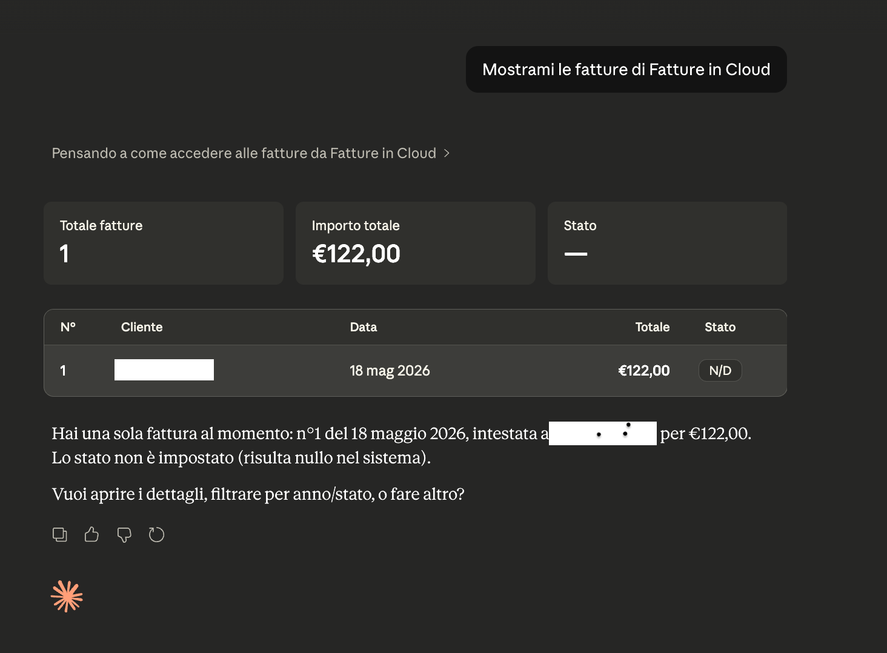

# fatture-cli

Command-line client for the [Fatture in Cloud](https://developers.fattureincloud.it/)
API, built for both humans and AI agents. Designed to be context-efficient: the
default output strips empty fields, and `--json` produces NDJSON suitable for
piping into LLMs or jq.

Part of [MayAI CLI](https://mayai.it).

## Requirements

- Python 3.11+
- A Fatture in Cloud developer app (free) — create one at
  https://developers.fattureincloud.it/

## Installation

```bash
pip install mayai-fatture-cli
```

Or from source:

```bash
git clone https://github.com/mayai-it/fatture-cli
cd fatture-cli
pip install -e .
```

For local development (adds `pytest`, `ruff`):

```bash
make dev
```

## MCP Server

fatture-cli ships with a native MCP server, letting AI agents like Claude
access your Fatture in Cloud data directly.



### Setup with Claude Desktop

Add to `~/Library/Application Support/Claude/claude_desktop_config.json`:

```json
{
  "mcpServers": {
    "fatture": {
      "command": "/path/to/fatture-mcp"
    }
  }
}
```

Find your path with: `which fatture-mcp`

### Compatible MCP clients

| Client | Status |
|--------|--------|
| Claude Desktop | ✅ Tested |
| Cursor | ✅ Same stdio config |
| Continue (VS Code) | ✅ Same stdio config |
| Zed | ✅ Same stdio config |
| ChatGPT | ⏳ MCP support coming soon |

### Available tools

| Tool | Description |
|------|-------------|
| `fatture_list_invoices` | List invoices (year, status, overdue, limit) |
| `fatture_get_invoice` | Get full invoice with lines and payments |
| `fatture_list_clients` | List all clients |
| `fatture_search_clients` | Search clients by name |
| `fatture_create_invoice` | Create a new invoice |
| `fatture_create_client` | Create a new client |
| `fatture_auth_status` | Check authentication status |

## FatturaPA XML

Generate and validate FatturaPA XML directly from your Fatture in Cloud invoices.

```bash
# Generate XML (prints to stdout)
fatture export invoice <id>

# Save to file
fatture export invoice <id> --output IT12345678901_0001.xml

# Validate against official XSD schema (v1.2.3)
fatture validate invoice <id>
```

The generated XML follows the **FatturaPA v1.2.3** schema (FPR12 format),
validated against the official XSD from fatturapa.gov.it.
Note: digital signature and SDI submission require a qualified certificate
and are outside the scope of this tool.

## Quick start

```bash
# 1. Authenticate (opens a browser for OAuth2 consent)
fatture auth login --client-id YOUR_ID --client-secret YOUR_SECRET

# 2. Verify
fatture auth status

# 3. List the 10 most recent invoices, paid only, as NDJSON
fatture --json list invoices --status paid --limit 10

# 4. Fetch a single invoice
fatture get invoice 526346861

# 5. Search clients by name
fatture search clients "Rossi"

# 6. List only overdue invoices (unpaid, due date in the past)
fatture list invoices --overdue

# 7. Create a new invoice
fatture create invoice --client 12345 --product "Consulenza" --amount 500 --date 2026-05-19

# 8. Create a new client
fatture create client --name "Acme S.r.l." --email info@acme.it --vat IT01234567890

# 9. Mark an invoice as paid
fatture update invoice 526346861 --status paid
```

## Command reference

| Command | Description |
|---|---|
| `fatture auth login --client-id ID --client-secret SECRET` | Run the OAuth2 flow and save credentials. |
| `fatture auth status` | Show whether credentials are present and valid. |
| `fatture auth logout` | Delete saved credentials. |
| `fatture list invoices [--year Y] [--status S] [--overdue] [--limit N]` | List issued invoices. `--overdue` keeps only unpaid invoices whose payment due date is in the past. |
| `fatture get invoice <id>` | Fetch a single invoice with lines and payments. |
| `fatture create invoice --client ID --product NAME --amount AMT --date YYYY-MM-DD` | Create a new invoice with a single line item. |
| `fatture update invoice <id> --status paid\|not_paid` | Update the payment status of an existing invoice. |
| `fatture list clients [--limit N]` | List all clients. |
| `fatture get client <id>` | Fetch a single client with address details. |
| `fatture create client --name NAME [--email E] [--vat V]` | Create a new client. `--name` is required; `--email` and `--vat` are optional. |
| `fatture search clients <query>` | Search clients by name (`LIKE '%query%'`). |
| `fatture list products [--limit N]` | List products / services. |
| `fatture get product <id>` | Fetch a single product. |

### Global flags

These work in any position (before or after the subcommand):

| Flag | Effect |
|---|---|
| `--json` | Emit one JSON object per line (NDJSON). |
| `--verbose` | Log HTTP method, URL, status, and duration to stderr. |
| `-h`, `--help` | Show help for the current command. |

### Exit codes

| Code | Meaning |
|---|---|
| `0` | Success |
| `1` | Application error (API 4xx/5xx, validation, etc.) |
| `2` | Not authenticated — run `fatture auth login` |

## Full command reference

### `fatture list invoices`

List issued invoices for the active company. Results stream until exhausted
unless `--limit` is passed.

```
fatture list invoices [--year YEAR] [--status STATUS] [--overdue] [--limit N]
```

| Flag | Type | Effect |
|---|---|---|
| `--year` | int | Keep only invoices issued in the given year. Translated to FiC's `year(date) = N` server-side filter. |
| `--status` | str | Server-side filter on document status: `paid`, `not_paid`, `partially_paid`, `expired`, etc. |
| `--overdue` | flag | Show only unpaid invoices whose payment due date is in the past. Applied **client-side** — FiC rejects `payment_status` inside the `q` expression, so the CLI fetches the page and drops rows where `status == "paid"` or no payment line is past-due. |
| `--limit` | int | Stop pagination after N invoices. |

```bash
# All invoices issued in 2026
fatture list invoices --year 2026

# Unpaid + overdue, as NDJSON
fatture --json list invoices --overdue

# Combine: overdue invoices from 2025 only
fatture list invoices --year 2025 --overdue
```

### `fatture create invoice`

Create a new invoice with a single line item. All four flags are required.

```
fatture create invoice --client ID --product NAME --amount AMOUNT --date YYYY-MM-DD
```

| Flag | Type | Effect |
|---|---|---|
| `--client` | int | Client (entity) id. Get it from `fatture list clients` or `fatture search clients`. |
| `--product` | str | Description of the line item. Used as both `name` and `description` in FiC. |
| `--amount` | float | Net unit price (taxes excluded). Quantity defaults to 1. |
| `--date` | str | Issue date in `YYYY-MM-DD`. |

Posts to `POST /c/{company_id}/issued_documents` with `type=invoice`. Emits
`{id, number, date}` on success — the `id` is what you pass to subsequent
`fatture get invoice` / `fatture update invoice` calls.

```bash
fatture create invoice \
    --client 12345 \
    --product "Consulenza maggio 2026" \
    --amount 500 \
    --date 2026-05-19
```

### `fatture create client`

Create a new client (entity of type `company`). `--name` is required;
`--email` and `--vat` are optional and dropped from the payload when empty.

```
fatture create client --name NAME [--email EMAIL] [--vat VAT_NUMBER]
```

Posts to `POST /c/{company_id}/entities/clients`. Emits `{id, name}`.

```bash
fatture create client \
    --name "Acme S.r.l." \
    --email info@acme.it \
    --vat IT01234567890

# Minimum form
fatture create client --name "Mario Rossi"
```

### `fatture update invoice`

Patch the payment status of an existing invoice. Only `payment_status` is
touched — the rest of the invoice is left untouched.

```
fatture update invoice <invoice_id> --status paid|not_paid
```

Sends `PUT /c/{company_id}/issued_documents/{id}` with the body
`{"data": {"payment_status": "paid"}}`. `--status` is constrained to
`paid` or `not_paid` via Click's `Choice` — other values are rejected
before any HTTP call is made.

```bash
fatture update invoice 526346861 --status paid
fatture update invoice 526346861 --status not_paid
```

## Authentication

Fatture in Cloud uses OAuth2 Authorization Code flow. The CLI handles the
full round-trip locally:

1. Create an app at https://developers.fattureincloud.it/ and register a
   redirect URI of the form `http://127.0.0.1:<port>/callback`. The default
   port is shown by `fatture auth login --no-browser`; use `--port 0` to pick
   a free one automatically.
2. Run `fatture auth login --client-id ... --client-secret ...`. The CLI
   spins up a one-shot HTTP server on the callback port, opens your browser
   to the Fatture in Cloud consent screen, captures the authorization code,
   and exchanges it for an access + refresh token.
3. After login the CLI fetches `/user/companies` and stores the first
   company's id as the default `company_id` for subsequent calls.
4. Tokens are saved to `~/.config/mayai-cli/fatture/credentials.json` with
   `0600` permissions. Refresh happens transparently on near-expiry or 401.

To revoke locally:

```bash
fatture auth logout
```

## Output format

- **Default** — compact human-readable text. Empty / null fields are stripped
  so terminal output stays scannable.
- **`--json`** — NDJSON. One object per line; lists stream one element per
  line so consumers can process incrementally.
- **`--verbose`** — adds one stderr line per HTTP request:
  `[fatture] GET https://... -> 200 in 287ms`.

Errors always go to stderr, prefixed with `error:`.

## Development

```bash
make dev       # install with dev extras
make test      # run pytest
make lint      # run ruff
make clean     # remove caches and build artifacts
```

## License

MIT — see [LICENSE](./LICENSE).
